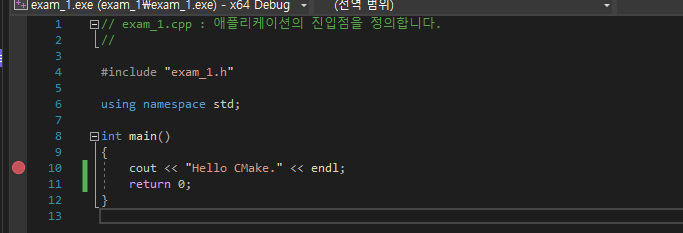

1. 함수 정의로 이동하기 : Ctrl + 클릭 or F12  
2. 뒤로 탐색, 앞으로 탐색 : Ctrl + (-), Ctrl + Shift + (-)  
3. 문장 위아래 위치 바꾸기 : Alt + 방향키  
4. 문자열 찾기, 한번에 바꾸기 : Ctrl + F  
5. 문자열 모조리 찾기 : Ctrl + Shift + F  
6. 함수명 쉽게 변경하기 : Ctrl + R + R  
7. 자동 정렬하기 : Ctrl + K + F  
8. 코드 자동 완성 : Tab (혹은 Tab 2번)  
9. 주석 설정 및 해제 : Ctrl + K + C / Ctrl + K + U  
10. 모든 참조 찾기 : Ctrl + Shift + G (개별 설정)  
11.   
12.   
13. function prototype만 보기 :Ctrl + M + O   
      
14. function 펼쳐 보기  :Ctrl + M + L  
      
15. 줄 블럭으로 켜서 묶기 : Alt + Shift + 방향  
16.  
